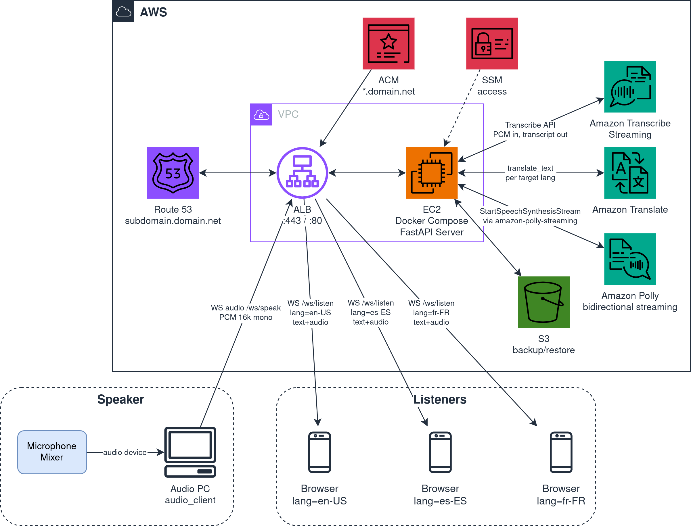
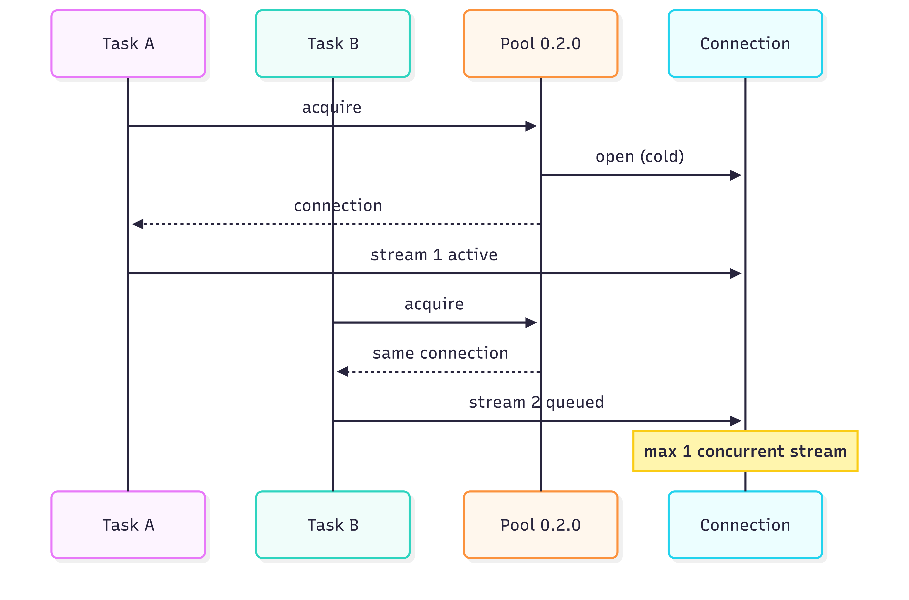
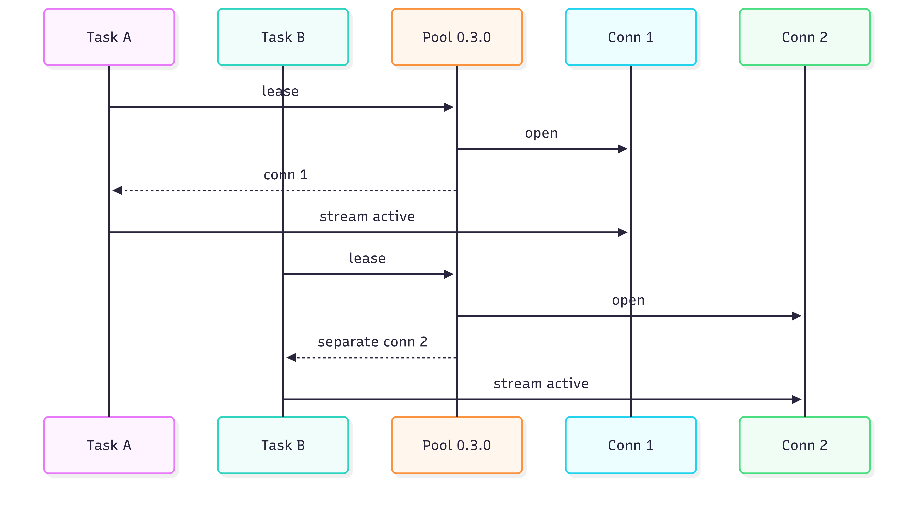

At a meetup's networking session, someone dropped: "the new speech-to-speech feature in Teams is really cool". Microsoft Teams added the interpreter agent with realtime AI-powered speech-to-speech translation during calls. So the natural question: how complicated is building one with AWS ? And what performance does it deliver ?

Meanwhile, for PyCon IT 2026, with an inclusivity goal, the plan was already to use [bilardi/realtime-transcription](https://github.com/bilardi/realtime-transcription) with a monitor in the room showing the talk transcript. But wouldn't it be handier if each attendee had the translated transcript directly on their own mobile, and maybe the audio in their own language too, naturally without installing anything ?

And so [bilardi/realtime-speech-to-speech](https://github.com/bilardi/realtime-speech-to-speech) was born, ready to use, for any conference or meetup. Under the hood there are three AWS services chained together: [Transcribe Streaming](https://docs.aws.amazon.com/transcribe/latest/dg/streaming.html) for Automatic Speech Recognition (ASR) from audio to text, [Translate](https://aws.amazon.com/translate/) for the translation, [Polly](https://aws.amazon.com/polly/) bidirectional streaming for Text-to-Speech (TTS) from text to audio. Architecture, costs and usage live in the repo: here, instead, I tell the choices and what went sideways along the way.

## A stage PoC for multilingual meetups

The initial alternatives were three, from the simplest to the most complex.

| Option | When it makes sense | Effort |
|---|---|---|
| One-way PoC, 1 speaker language → 1 listener language | Minimal validation of the AWS pipeline | Headphones to keep the mic from recapturing the TTS |
| Bidirectional 1:1 conversation | International meeting between two people | Two symmetric pipelines + a second device to test |
| 1-to-many conference (fan-out), multilingual | Talks and meetups with international audience | Browser audio playback + N parallel pipelines under contention |

I started from the 1:1 one-way PoC to validate the AWS pipeline and the new piece (Polly bidirectional streaming plus the browser audio playback), and from there moved on to 1-to-many, which is the real scenario for a conference or a meetup. Direction and language pair stay as two environment variables: changing scenario becomes editing two lines in `.env`, no refactor.

Listener client: the browser. Mobile has it without installing anything, and opening a URL is the simplest UX for the "PC speaks, mobile listens" test. A native app isn't worth it even in production for this use case, let alone for a PoC: targets to maintain, stores to publish to, zero advantages over a page opened from a QR code.

### Why not Nova 2 Sonic ?

AWS [recently announced](https://aws.amazon.com/about-aws/whats-new/2025/12/amazon-nova-2-sonic-real-time-conversational-ai/) [Amazon Nova 2 Sonic](https://docs.aws.amazon.com/nova/latest/nova2-userguide/using-conversational-speech.html): an end-to-end speech-to-speech model, ASR plus LLM plus TTS in a single bidirectional connection. Obligatory question: why not Nova Sonic, then ?

Nova Sonic is designed to **respond** to an audio: conversational assistant, human-AI dialogue, turn-taking, managed interruptions. The use case here is the opposite: a **transmission to multiple listeners, a different language for each (multilingual broadcast)**, with faithful translation. For example, Italian audio as input, the same sentence as audio in N different languages as output, across N parallel channels. They are two different products: the fact that both go by "speech-to-speech" is a marketing collision.

Mapping the current three stages against Nova Sonic:

| Current stage | Function | Nova 2 Sonic covers ? | Same guarantee ? |
|---|---|---|---|
| Transcribe Streaming | ASR audio to text | Yes, integrated | Plausible, but I haven't tested |
| Translate | Deterministic Neural Machine Translation (NMT) | Yes, via prompting | No, not deterministic |
| Polly Generative | TTS reading quality | Yes, conversational voices | No, dialogue intonation |

The three critical points, from most to least blocking:

- **Translate**: an NMT trained for faithful, deterministic translation. Nova Sonic would do translation via LLM prompting: more fluent but not deterministic, may paraphrase or add conversational fillers. Unacceptable for a broadcast where the audience expects exactly what the speaker says
- **Polly Generative**: voices optimized for reading a given text. Nova Sonic has voices optimized for dialogue, intonation that adapts to the user's voice input. For reading a translation it's the wrong voice
- **Transcribe**: replaceable in principle, but Nova Sonic doesn't expose ASR as a standalone service billed separately

Operational constraints independent of quality: 8-minute connection limit against Transcribe Streaming's 4 hours, and Nova requires a separate session per target language (the current pipeline calls Transcribe once for N languages).

Decision: pipeline with three specialized services. Nova 2 Sonic stays the natural candidate for a different scenario, where the listener asks the AI a question and the AI answers, not for a meetup with a human speaker and a passive audience.

## Here is the stack

As a lazy developer, the first thing I looked for is reusable pieces. `realtime-transcription` already has the `audio_client/` module to capture Pulse-Code Modulation (PCM) audio from a device and the FastAPI WebSocket scaffold: cherry-pick roughly 140 lines and you're off. The browser display, instead, is from scratch, because audio playback is a different beast from text display.

The server-side pipeline is simple and linear: Transcribe streaming → Translate one-shot → Polly bidirectional. Transcribe can deliver a partial text (`is_partial=True`) on faster timing, but it might be wrong and so cancelled and rewritten: the goal is validating the chain end to end, not shaving milliseconds of latency. Everything therefore starts from Transcribe once it has recognized a complete sentence (`is_partial=False`): at that point Translate fires with a single call per sentence, and the translated text goes to Polly bidirectional, which begins returning audio while it's still generating the rest.

For the audio format the options were compressed MP3 and raw PCM. MP3 uses ~4 times less bandwidth, but the browser has to decode it asynchronously for each chunk (`decodeAudioData`), breaking the continuity of the playback queue. PCM (16-bit signed LE, 16 kHz mono) weighs more on bandwidth but the browser writes it straight into a Web Audio API `AudioBuffer`: no intermediate decoding, linear queue. On LAN or local WiFi bandwidth isn't the constraint, latency is: I picked PCM. On top of that, 16 kHz mono matches the sample rate of the microphone and of Transcribe: no format conversion in the middle of the pipeline. In the cloud, where the audio going out from the server to each listener is data transfer out (AWS egress, billed), PCM might blow past the 100GB / month free tier, which is ~35h with 25 listeners.

To pick a Polly voice in the target language, there were two paths. A hardcoded `(language) → (voice id)`: simple but it breaks every time AWS publishes new voices. The other calls `DescribeVoices` at server boot and discovers dynamically what's available, with an in-memory cache. I picked the second: one API call at startup, zero maintenance when AWS adds voices. To stay compatible with bidirectional streaming I filtered by `LanguageCode` (the target language) and by voices that support it: the feature is recent (2026) and not every language covers it, so without the filter synthesis would fail at the first `start_speech_synthesis_stream`.

The truly new piece is precisely `StartSpeechSynthesisStream`, the Amazon Polly bidirectional API. [Announced in March 2026](https://aws.amazon.com/about-aws/whats-new/2026/03/amazon-polly-expands-TTS-new-voices-and-bidirectional-streaming/), exposed in the [Java SDK](https://aws.amazon.com/blogs/machine-learning/introducing-amazon-polly-bidirectional-streaming-real-time-speech-synthesis-for-conversational-ai/), and missing in boto3. The feature shows up in the Java SDK because its code generator reads `service-2.json` and supports the HTTP/2 bidirectional event-stream protocol. Under boto3 there's botocore, and even botocore doesn't have that infrastructure: the operation stays declared in the [service model](https://github.com/boto/botocore/blob/develop/botocore/data/polly/2016-06-10/service-2.json#L127-L142) but the Python client doesn't expose it. Same scenario for aioboto3, the asynchronous version of boto3, which reuses the same service models. Verified on boto3 1.43.9.

So, what paths are available ?

| Path | Pros | Cons |
|---|---|---|
| `synthesize_speech` sync | Already in the SDK, 5 lines | No fast first-byte: waits until Polly has generated all the audio before returning any byte |
| HTTP/2 raw + SigV4 + event-stream parser | Real bidirectional, first audio chunk arriving while Polly is still generating | Not in Python: needs to be written from scratch |

Decision: the sync one first to validate the pipeline, then the bidirectional one.

And here begins the piece that became a package of its own: [amazon-polly-streaming](https://amazon-polly-streaming.readthedocs.io/en/latest/). A PR to boto3 would have been the first reflex, but boto3 doesn't have the HTTP/2 bidirectional event-stream infrastructure. For Transcribe streaming AWS kept it out of boto3 in a separate package under awslabs: first in [`amazon-transcribe-streaming-sdk`](https://github.com/awslabs/amazon-transcribe-streaming-sdk/) (deprecated today) that delegates the HTTP/2 transport to [`awscrt`](https://github.com/awslabs/aws-crt-python), then in [`aws-sdk-transcribe-streaming`](https://github.com/awslabs/aws-sdk-python/tree/develop/clients/aws-sdk-transcribe-streaming) (the successor) that delegates the event-stream too to [`smithy_aws_core`](https://github.com/awslabs/smithy-python/tree/develop/packages/smithy-aws-core). For Polly bidirectional an official equivalent doesn't exist yet (verified in May 2026, neither on awslabs nor on PyPI), so `amazon-polly-streaming` is the first public Python implementation of the feature.

The public API is `PollyStreamingClient.start_speech_synthesis_stream()`, a mirror of `TranscribeStreamingClient.start_stream_transcription()` from `aws-sdk-transcribe-streaming`. Same pattern as the official AWS package for Transcribe: a convention that lets future adoption by awslabs happen without redesigning the API. Same for exceptions: a separate module that mirrors the types Polly exposes in `StartSpeechSynthesisStream`.

And why not delegate the HTTP/2 bidirectional event-stream to `smithy_aws_core[eventstream]`, the way `aws-sdk-transcribe-streaming` does ? The bulk of the package would stay uncovered: AWS hasn't published a smithy client for Polly bidirectional. Since that client doesn't exist, it's simpler to keep the protocol in-house too: one fewer dependency, and no need to sync `amazon-polly-streaming`'s cycles with those of an external lib under active development.

## The stories the README doesn't tell

### That `ServiceFailureException` that says nothing

I started from the [AWS documentation for `StartSpeechSynthesisStream`](https://docs.aws.amazon.com/polly/latest/dg/API_StartSpeechSynthesisStream.html): it lists the parameters (`Engine`, `LanguageCode`, `VoiceId`, `OutputFormat`, ..) and the event types (`TextEvent`, `CloseStreamEvent`, `AudioEvent`), but doesn't explain how to package the bidirectional event-stream body. The first attempt was therefore naive: I built a single event-stream body with `TextEvent` followed by `CloseStreamEvent`, signed it with SigV4 in its standard form (`HTTP_REQUEST_HEADERS` headers and `EMPTY_SHA256` payload), and sent it in one shot. AWS Polly's response:

```
ServiceFailureException: Service is unavailable
```

That's it. No "this header is missing", no "the body isn't the type I expect", nothing that lets you figure out what's wrong. Always the same response across every combination I tried. Pushing harder on the Polly endpoint by tweaking parameters was therefore pointless: the contract had to be found elsewhere.

I checked botocore's `service-2.json` file (the same file is in the Java SDK, but only the latter implements it in a client): it's the canonical declaration of the AWS contract, committed to the repos as input for the code generator. For Polly it declares [`protocol: "rest-json"` with `protocolSettings: { h2: "eventstream" }`](https://github.com/boto/botocore/blob/develop/botocore/data/polly/2016-06-10/service-2.json#L6-L7) and an [`ActionStream` payload of type `eventstream`](https://github.com/boto/botocore/blob/develop/botocore/data/polly/2016-06-10/service-2.json#L810-L824). It's the same protocol Transcribe Streaming uses for `start-stream-transcription`, and for Transcribe a public Python implementation already exists: [`amazon-transcribe-streaming-sdk`](https://github.com/awslabs/amazon-transcribe-streaming-sdk/blob/develop/amazon_transcribe/eventstream.py#L681-L741) (Apache 2.0, awslabs). I read the transcribe-sdk and ported its signing logic to [`amazon-polly-streaming`](https://github.com/bilardi/amazon-polly-streaming/blob/master/amazon_polly_streaming/_event_signer.py#L44-L116), adapting it to Polly.

What I learned (the hard way):
- AWS errors like `ServiceFailureException` don't say what went wrong: a design choice. For AWS services not yet in boto3, you have to go straight to the `service-2.json` file (in botocore or in the Java SDK, they are identical): faster than debugging parameter by parameter
- `smithy_aws_core[eventstream]` is today the most complete Python reference for the generic part of the AWS HTTP/2 bidirectional event-stream; the event types (for Polly: `TextEvent`, `CloseStreamEvent`, `AudioEvent`) aren't there, whoever builds the client writes them (in this case the Polly client)
- the Java SDK v2 client code is generated automatically at build time from `service-2.json`, it isn't committed in the repo: searching the method name (e.g. `startSpeechSynthesisStream`) in the source returns only changelogs and the service model, not the real signatures. For the protocol contract, `service-2.json` stays the canonical source (both in the Java SDK and in botocore)

### That pool that worked solo

An HTTPS call to AWS has a cost: before exchanging the first byte of data, there's the TLS handshake and the HTTP/2 setup. A connection pool removes that cost for every call after the first: open once, reuse N times. On a pipeline that calls Polly bidirectional once per finalized sentence it's an immediate win: ~50 ms less median per call, from the second call onwards.

I added the HTTP/2 pool in `amazon-polly-streaming` v0.2.0 with `use_pool=True` as the default, and on a single listener it worked fine ..

Then I implemented the multilingual broadcast fan-out: 1 speaker to N listeners, each with its own target language. The test with 2 listeners (`en-US` and `de-DE`), 5 sentences per 2 target languages: I expected 10 calls to Polly. Instead half of the calls emitted no audio. Alternating pattern: in the same execution one language always "won" and the other always "lost", but across different executions the role flipped. So it wasn't language-specific, it was specific to the **second parallel task** of the fan-out iteration (a `for target in targets:` over an unordered `set`).



Diagnosis: pool v0.2.0 kept **one and only** `HttpClientConnection` per `(host, port)` pair. Under fan-out, two near-simultaneous calls asked the pool for a connection to Polly: the first opened one from scratch, the second received the same connection already open. Both opened a new HTTP/2 stream on the same connection. But Polly bidirectional enforces "1 stream = 1 sentence" and the Polly endpoint accepts only one active bidirectional stream at a time: what I observed was that awscrt queued the second stream until the first one closed. Under fan-out the queue never drained: before the first one finished, the next sentence arrived. From here two moves: one immediate and one structural.

As a lazy developer, the workaround first: `POLLY_USE_POOL=false` so every call opened a fresh connection and every call produced audio. Cost: the ~50 ms gained earlier from the pool were lost on every call. The refactor of `_ConnectionPool` with lease semantics was needed: `amazon-polly-streaming` v0.3.0 creates a list of connections per `(host, port)` instead of a single one, so every fan-out task leases a distinct connection (opened cold the first time, reused after that).



Improvement table across iterations. The `polly_first_byte_ms` metric measures the time between when Translate returns the translated text and the first audio byte arriving from Polly: TLS plus HTTP/2 setup plus Polly's start-up latency. It's not the end-to-end latency perceived by the listener (which also includes server-to-browser forwarding).

| Scenario | Median `polly_first_byte_ms` warm |
|---|---:|
| Single listener, no pool | ~370 ms |
| Single listener, with pool (v0.2.0) | ~331 ms |
| Fan-out 1-to-2, workaround without pool (v0.2.0) | ~373 ms |
| Fan-out 1-to-2, with fixed pool (v0.3.0) | **~306 ms** |

The fixed pool in v0.3.0 beats every previous measurement: ~25 ms less median compared to the single-listener pool in v0.2.0. This extra delta comes from pipeline optimizations accumulated across iterations, orthogonal to the pool but that show up in the final result.

### That WAF that, thankfully, isn't needed

At the first deploy on EC2 via [`aws-docker-host`](https://github.com/bilardi/aws-docker-host), with a public ALB at `https://sts.workshop.pandle.net`, uvicorn's logs filled up within minutes of the `apply` with:

```
POST /hello.world?%ADd+allow_url_include%3d1+%ADd+auto_prepend_file%3dphp://input   404
GET  /vendor/phpunit/phpunit/src/Util/PHP/eval-stdin.php                            404
GET  /vendor/phpunit/Util/PHP/eval-stdin.php                                        404
GET  /phpunit/phpunit/src/Util/PHP/eval-stdin.php                                   404
```

Tens of requests per minute: no problem, FastAPI answers 404 to all of them. The real risk is different: a targeted bot connects to `/ws/speak` or `/ws/listen` and fires Transcribe plus Translate plus Polly at the expense of the AWS account owner. The figure is low per single call but scales linearly with the number of malicious connections.

So, how do you defend yourself ?

| Option | Pros | Cons |
|---|---|---|
| IP allowlist on the ALB security group | Granular | The audience IPs at the talk are not known in advance |
| AWS WAF with rules on scanner patterns | Blocks the known noise (scanner UA, PHP paths) | Doesn't block "competent" abuse (bot with browser UA, correct path), and costs 5-10 € / month |
| Single shared token | Simple to implement | The QR code reaches tens of people, to be treated as a secret |
| Double token per role | Exposure asymmetry | 15 extra lines of code |

Decision: double token. `SPEAKER_TOKEN` protects `/ws/speak` (the cost driver: Transcribe plus Translate plus Polly for N languages), `LISTENER_TOKEN` protects `/ws/listen` (the distribution path via QR code). Independent: the listener token doesn't work for the speaker, and vice versa. If the QR code leaks (photos on social, screenshots, shares), the damage is limited to "anyone can listen", not "anyone can spend the AWS owner's money". The `SPEAKER_TOKEN` stays in the shell history and in the `.env` of the deploy.

The design stays minimal at every level. Locally, with no tokens set, authentication is off and nothing changes. The architecture adds no complications: no cookies, no login form, no OAuth, just a string comparison at each connection. And the code fits in a few lines on the server, a flag on the audio client, a URL parameter for the browsers, a few sample environment variables. Good enough for a PoC with frequent token rotation between events.

## What else could be added ?

**Signed JWTs in place of static tokens**: for prolonged use (always-on service, multiple events) JWTs with TTL per role. If the internet exposure becomes continuous, manually rotating the two static tokens gets tiring.

**Subtitles sync**: the translated text arrives at the browser as a JSON message before the audio, so it's already on screen when the audio starts. A precise text-to-audio sync (word-by-word highlight) is the next step for accessibility. Polly exposes `SpeechMark` exactly for this in the sync synthesize; for the bidirectional one they need to be checked in `service-2.json`.

**Pause-based hybrid transcription pipeline**: to cut the perceived latency between "I'm done speaking" and "first audio byte", the pipeline needs to fire even when a Transcribe partial has been still for N milliseconds, not only when `is_partial=False` arrives. Worth it only if you really want to optimize timing to the millisecond: the current sentence-bounded handling is enough, and implementing it requires a cancellation logic that's anything but trivial, because when Transcribe corrects a partial, the pipeline may already have fired translation and synthesis: you have to decide whether to let them finish, cancel them, or replace them.

**Adoption of `amazon-polly-streaming` by awslabs**: today it's the first public Python implementation of Polly bidirectional. The concrete path is a PR to [`aws-sdk-python`](https://github.com/awslabs/aws-sdk-python) to publish `aws-sdk-polly-streaming` (sibling of `aws-sdk-transcribe-streaming`), built on top of the generic primitives of `smithy_aws_core[eventstream]`. When that client exists, `amazon-polly-streaming` can be considered deprecated.
