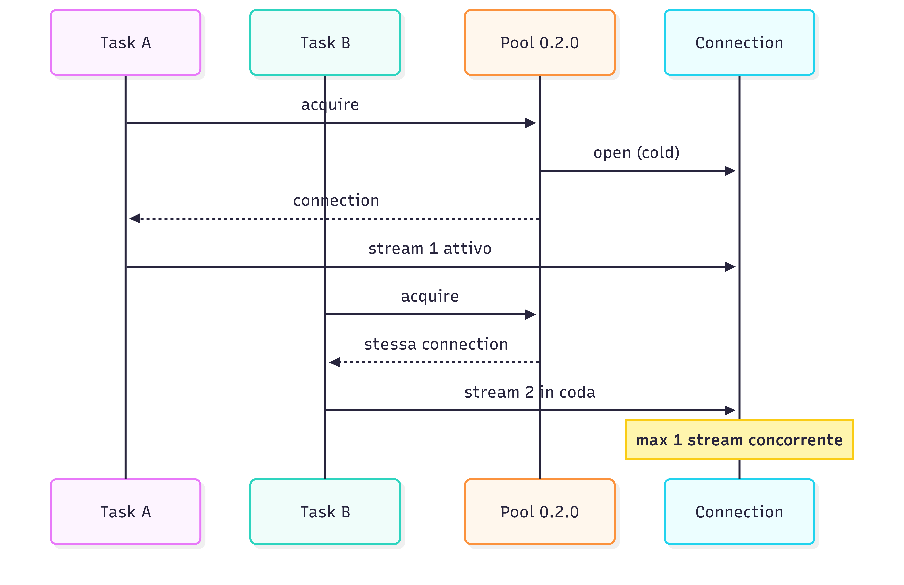
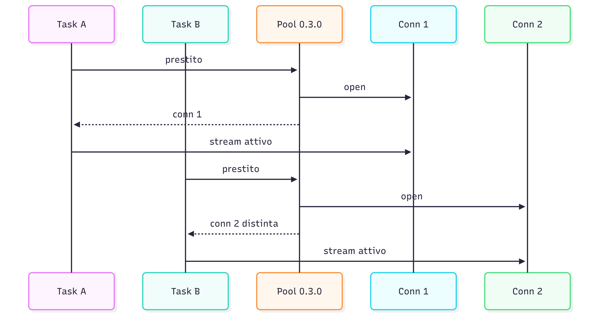

Durante il networking di un meetup, qualcuno è uscito con: "è una figata la nuova feature speech-to-speech di Teams". Microsoft Teams ha aggiunto l'interpreter agent con la traduzione realtime speech-to-speech AI-powered in chiamata. E quindi la domanda sorge spontanea: ma quanto complicato è farne uno con AWS ? E che performance ha ?

Nel frattempo, per la PyCon IT 2026, a scopo inclusivo, il piano era già usare [bilardi/realtime-transcription](https://github.com/bilardi/realtime-transcription) con un monitor a sala che visualizzasse il trascritto del talk. Ma sarebbe stato più comodo se ciascun partecipante avesse avuto direttamente sul proprio mobile il trascritto tradotto, e magari anche l'audio nella sua lingua, naturalmente senza installare nulla ?

E così è nato [bilardi/realtime-speech-to-speech](https://github.com/bilardi/realtime-speech-to-speech), pronto all'uso, per qualsiasi conferenza o meetup. Sotto al cofano ci sono tre servizi AWS in catena: [Transcribe Streaming](https://docs.aws.amazon.com/transcribe/latest/dg/streaming.html) per l'Automatic Speech Recognition (ASR) audio verso testo, [Translate](https://aws.amazon.com/translate/) per la traduzione, [Polly](https://aws.amazon.com/polly/) bidirectional streaming per il Text-to-Speech (TTS) testo verso audio. Architettura, costi e usage stanno nel repo: qui, invece, racconto le scelte e quello che è andato storto nel mezzo.

## Un PoC da palco per meetup multilingua

Le alternative iniziali erano tre, dalla più semplice alla più complessa.

| Opzione | Quando ha senso | Effort |
|---|---|---|
| PoC monodirezionale, 1 lingua speaker → 1 lingua listener | Validazione minima della pipeline AWS | Cuffiette per evitare che il microfono ricatturi il TTS |
| Conversazione 1:1 bidirezionale | Riunione internazionale fra due interlocutori | Due pipeline simmetriche + secondo dispositivo per il test |
| Conferenza 1-a-molti (fan-out), multilingua | Talk e meetup con pubblico internazionale | Browser audio playback + N pipeline parallele in concorrenza |

Sono partita dal PoC 1:1 monodirezionale per validare la pipeline AWS e il pezzo nuovo (Polly bidirectional streaming più l'audio playback in browser), e da lì sono passata 1-a-molti, che è poi lo scenario reale della conferenza o del meetup. Direzione e coppia di lingue restano due variabili d'ambiente: cambiare scenario diventa modificare due righe in `.env`, niente refactor.

Listener client: il browser. Il mobile lo ha senza installare nulla, e aprire un URL è la UX più semplice per il test "PC parla, mobile ascolta". Un'app nativa non vale la pena nemmeno in produzione per questo caso d'uso, figuriamoci per un PoC: target da mantenere, store da pubblicare, zero vantaggi rispetto a una pagina aperta da QR code.

### Perché non Nova 2 Sonic ?

AWS ha [presentato](https://aws.amazon.com/about-aws/whats-new/2025/12/amazon-nova-2-sonic-real-time-conversational-ai/) da poco [Amazon Nova 2 Sonic](https://docs.aws.amazon.com/nova/latest/nova2-userguide/using-conversational-speech.html): modello speech-to-speech end-to-end, ASR più LLM più TTS in un'unica connessione bidirezionale. Domanda obbligata: perché allora non Nova Sonic ?

Nova Sonic è progettato per **rispondere** a un audio: assistente conversazionale, dialogo uomo-AI, alternanza nei turni di parola (turn-taking), interruzioni gestite. Il caso d'uso qui è opposto: una **trasmissione a più ascoltatori, una lingua diversa per ognuno (broadcast multilingua)**, con traduzione fedele. Per esempio, audio in italiano in input, audio della stessa frase in N lingue diverse in output, su N canali in parallelo. Sono due prodotti diversi: il fatto che entrambi si chiamino "speech-to-speech" è una collisione di marketing.

Mappatura dei tre stadi attuali contro Nova Sonic:

| Stadio attuale | Funzione | Nova 2 Sonic copre ? | Stessa garanzia ? |
|---|---|---|---|
| Transcribe Streaming | ASR audio verso testo | Sì, integrato | Plausibile, ma non l'ho testato |
| Translate | Neural Machine Translation (NMT) deterministica | Sì, via prompting | No, non deterministica |
| Polly Generative | TTS qualità lettura | Sì, voci conversazionali | No, intonazione da dialogo |

I tre punti critici, dal più al meno bloccante:

- **Translate**: è un NMT addestrato per traduzione fedele e deterministica. Nova Sonic farebbe traduzione via prompting di un LLM: più fluente ma non deterministico, può parafrasare o aggiungere filler conversazionali. Inaccettabile per un broadcast dove il pubblico si aspetta esattamente quello che dice lo speaker
- **Polly Generative**: voci ottimizzate per leggere un testo dato. Nova Sonic ha voci ottimizzate per dialogo, intonazione che si adatta all'input vocale dell'utente. Per la lettura di una traduzione è la voce sbagliata
- **Transcribe**: sostituibile in linea di principio, ma Nova Sonic non espone l'ASR come servizio standalone tariffato a parte

Vincoli operativi indipendenti dalla qualità: connection limit di 8 minuti contro le 4 ore di Transcribe Streaming, e Nova richiede una sessione separata per lingua target (la pipeline attuale chiama Transcribe una sola volta per N lingue).

Decisione: pipeline a tre servizi specializzati. Nova 2 Sonic resta candidato naturale per uno scenario diverso, dove il listener fa una domanda all'AI e l'AI risponde, non per un meetup con uno speaker umano e un pubblico passivo.

## Ecco lo stack

Da buon developer pigro, la prima cosa che ho cercato sono pezzi riusabili. `realtime-transcription` ha già il modulo `audio_client/` per catturare l'audio Pulse-Code Modulation (PCM) da device e lo scaffold WebSocket FastAPI: cherry-pick di circa 140 righe e si parte. Il display browser invece è ex novo, perché l'audio playback è una bestia diversa da text display.

La pipeline server-side è semplice e lineare: Transcribe streaming → Translate one-shot → Polly bidirectional. Transcribe permette di fornire un testo parziale (`is_partial=True`) in tempi più rapidi, ma potrebbe essere sbagliato e quindi cancellato e riscritto: lo scopo è validare la catena di servizi dall'inizio alla fine, non strappare millisecondi di latenza. Quindi tutto parte da Transcribe quando ha riconosciuto una frase completa (`is_partial=False`): a quel punto parte Translate con una sola chiamata per frase, e il testo tradotto va a Polly bidirectional, che inizia a restituire audio mentre sta ancora generando il resto.

Per il formato audio le opzioni erano MP3 compresso e PCM raw. MP3 occupa ~4 volte meno banda, ma il browser deve decodificarlo asincrono per ogni chunk (`decodeAudioData`), rompendo la continuità della coda di playback. PCM (16-bit signed LE, 16 kHz mono) pesa di più in banda ma il browser lo scrive diretto in un `AudioBuffer` di Web Audio API: nessuna decodifica intermedia, coda lineare. Su LAN o WiFi locale la banda non è il vincolo, la latenza sì: ho scelto PCM. In più, 16 kHz mono coincide col sample rate del microfono e di Transcribe: nessuna conversione di formato in mezzo alla pipeline. Sul cloud, dove l'audio in uscita dal server verso ogni listener è data transfer out (egress AWS, a pagamento), PCM potrebbe far superare la free tier di 100GB / mese, che sono ~35h con 25 listener.

Per scegliere una voce Polly nella lingua target, c'erano due strade. Una hardcoded `(lingua) → (voice id)`: semplice ma si rompe ogni volta che AWS pubblica voci nuove. L'altra chiama `DescribeVoices` al boot del server e scopre dinamicamente cosa è disponibile, con cache in memoria. Ho scelto la seconda: una chiamata API all'avvio, zero manutenzione quando AWS aggiunge voci. Per essere compatibili con bidirectional streaming ho filtrato per `LanguageCode` (la lingua target) e per le voci che la supportano: la feature è recente (2026) e non tutte le lingue la coprono, quindi senza il filtro la sintesi fallirebbe al primo `start_speech_synthesis_stream`.

Il pezzo davvero nuovo è proprio `StartSpeechSynthesisStream`, l'API bidirectional di Amazon Polly. [Annunciata a marzo 2026](https://aws.amazon.com/about-aws/whats-new/2026/03/amazon-polly-expands-TTS-new-voices-and-bidirectional-streaming/), esposta nel [Java SDK](https://aws.amazon.com/blogs/machine-learning/introducing-amazon-polly-bidirectional-streaming-real-time-speech-synthesis-for-conversational-ai/), e mancante in boto3. La feature appare nel Java SDK perché il suo code generator legge `service-2.json` e supporta il protocollo HTTP/2 bidirectional event-stream. Sotto boto3 c'è botocore, e nemmeno botocore ha quell'infrastruttura: l'operazione resta dichiarata nel [service model](https://github.com/boto/botocore/blob/develop/botocore/data/polly/2016-06-10/service-2.json#L127-L142) ma il client Python non la espone. Stesso scenario per aioboto3, la versione asincrona di boto3, che riusa gli stessi service models. Verificato su boto3 1.43.9.

Quindi, che strade ci sono ?

| Strada | Pro | Contro |
|---|---|---|
| `synthesize_speech` sincrono | Già nell'SDK, 5 righe | Niente fast first-byte: aspetta che Polly generi tutto l'audio prima di restituire byte |
| HTTP/2 raw + SigV4 + event-stream parser | Vero bidirezionale, primo chunk audio in arrivo mentre Polly sta ancora generando | Non c'è in Python: va scritto da zero |

Decisione: prima il sincrono per validare la pipeline e poi il bidirezionale.

E qui inizia il pezzo che è diventato un package a sé: [amazon-polly-streaming](https://amazon-polly-streaming.readthedocs.io/en/latest/). Una PR a boto3 sarebbe stato il primo riflesso, ma boto3 non ha l'infrastruttura HTTP/2 bidirectional event-stream. Per Transcribe streaming AWS l'ha tenuto fuori da boto3 in un package separato in awslabs: prima in [`amazon-transcribe-streaming-sdk`](https://github.com/awslabs/amazon-transcribe-streaming-sdk/) (oggi deprecato) che delega il trasporto HTTP/2 a [`awscrt`](https://github.com/awslabs/aws-crt-python), poi in [`aws-sdk-transcribe-streaming`](https://github.com/awslabs/aws-sdk-python/tree/develop/clients/aws-sdk-transcribe-streaming) (il successore) che delega anche l'event-stream a [`smithy_aws_core`](https://github.com/awslabs/smithy-python/tree/develop/packages/smithy-aws-core). Per Polly bidirectional un equivalente ufficiale non esiste ancora (verificato a maggio 2026, né su awslabs né su PyPI), quindi `amazon-polly-streaming` è la prima implementazione Python pubblica della feature.

L'API pubblica è `PollyStreamingClient.start_speech_synthesis_stream()`, mirror di `TranscribeStreamingClient.start_stream_transcription()` di `aws-sdk-transcribe-streaming`. Stesso pattern del package ufficiale di AWS per Transcribe: convenzione che permette in futuro un'eventuale adozione da parte di awslabs senza dover ri-progettare l'API. E anche per le eccezioni: un modulo separato che ricalca i tipi che Polly espone in `StartSpeechSynthesisStream`.

E perché non delegare l'HTTP/2 bidirectional event-stream a `smithy_aws_core[eventstream]`, come fa `aws-sdk-transcribe-streaming` ? Il grosso del package resta scoperto: AWS non ha pubblicato un client smithy per Polly bidirectional. Dato che quel client non esiste, è più semplice tenere anche il protocollo in casa: una dipendenza in meno, e nessun bisogno di sincronizzare i cicli di `amazon-polly-streaming` con quelli di una lib esterna in sviluppo attivo.

## Le storie che il README non racconta

### Quel `ServiceFailureException` che non vuole dire niente

Sono partita dalla [documentazione AWS di `StartSpeechSynthesisStream`](https://docs.aws.amazon.com/polly/latest/dg/API_StartSpeechSynthesisStream.html): elenca i parametri (`Engine`, `LanguageCode`, `VoiceId`, `OutputFormat`, ..) e i tipi di evento (`TextEvent`, `CloseStreamEvent`, `AudioEvent`), ma non spiega come confezionare il body event-stream bidirectional. Il primo tentativo era quindi ingenuo: ho costruito un body event-stream singolo con `TextEvent` seguito da `CloseStreamEvent`, l'ho firmato con SigV4 nella sua forma standard (intestazioni `HTTP_REQUEST_HEADERS` e payload `EMPTY_SHA256`), e l'ho inviato in un colpo solo. Risposta di AWS Polly:

```
ServiceFailureException: Service is unavailable
```

Tutto qui. Niente "manca questo header", niente "il body non è del tipo che mi aspetto", niente che permetta di capire cosa si sta sbagliando. Sempre la stessa risposta su tutte le combinazioni che ho provato. Era quindi inutile insistere sull'endpoint di Polly cambiando parametri: il contratto andava cercato altrove.

Ho controllato il file `service-2.json` di botocore (lo stesso file è nel Java SDK, ma solo quest'ultimo l'ha implementato in un client): è la dichiarazione canonica del contratto AWS, committata nei repo come input al code generator. Per Polly dichiara [`protocol: "rest-json"` con `protocolSettings: { h2: "eventstream" }`](https://github.com/boto/botocore/blob/develop/botocore/data/polly/2016-06-10/service-2.json#L6-L7) e [payload `ActionStream` di tipo `eventstream`](https://github.com/boto/botocore/blob/develop/botocore/data/polly/2016-06-10/service-2.json#L810-L824). È lo stesso protocollo che Transcribe Streaming usa per `start-stream-transcription`, e per Transcribe esiste già una implementazione in Python pubblica: [`amazon-transcribe-streaming-sdk`](https://github.com/awslabs/amazon-transcribe-streaming-sdk/blob/develop/amazon_transcribe/eventstream.py#L681-L741) (Apache 2.0, awslabs). Ho letto il transcribe-sdk e ne ho portato la logica di firma in [`amazon-polly-streaming`](https://github.com/bilardi/amazon-polly-streaming/blob/master/amazon_polly_streaming/_event_signer.py#L44-L116), adattandola a Polly.

Cosa ho imparato:
- Gli errori AWS come `ServiceFailureException` non dicono cosa è andato storto: una scelta di design. Per servizi AWS non ancora in boto3, bisogna andare direttamente sul file `service-2.json` (in botocore o nel Java SDK, sono uguali): è più rapido che debuggare per parametri
- `smithy_aws_core[eventstream]` è oggi la reference Python più completa per la parte generica dell'HTTP/2 bidirectional event-stream AWS; i tipi di evento (per Polly: `TextEvent`, `CloseStreamEvent`, `AudioEvent`) non ci sono, li scrive chi costruisce il client (in questo caso il client di Polly)
- Il codice client del Java SDK v2 è generato automaticamente al build time dal `service-2.json`, non è committato nel repo: cercare il nome del metodo (es. `startSpeechSynthesisStream`) nel codice sorgente ritorna solo changelog e service model, non le firme reali. Per il contratto del protocollo, `service-2.json` resta la fonte canonica (sia nel Java SDK che in botocore)

### Quel pool che funzionava in solitaria

Una chiamata HTTPS verso AWS costa: prima ancora di scambiare il primo byte di dato, ci sono il TLS handshake e il setup HTTP/2. Un pool di connessioni elimina quel costo per le chiamate successive alla prima: apri una volta, riusi N volte. Su una pipeline che chiama Polly bidirectional una volta per frase finalizzata è una vittoria immediata: ~50 ms in meno di mediana per chiamata, dalla seconda in poi.

Il pool HTTP/2 l'ho aggiunto in `amazon-polly-streaming` v0.2.0 con `use_pool=True` come default, e sul singolo listener funzionava bene ..

Poi ho implementato il fan-out broadcast multilingua: 1 speaker verso N listener, ognuno con la sua lingua di destinazione. Il test con 2 listener (`en-US` e `de-DE`), 5 frasi per 2 lingue target: mi aspettavo 10 chiamate a Polly. Invece metà delle chiamate non hanno emesso audio. Pattern alternato: in una stessa esecuzione una lingua "vinceva" sempre e l'altra "perdeva" sempre, ma fra esecuzioni diverse il ruolo si invertiva. Quindi non era specifico della lingua, era specifico del **secondo task** parallelo dell'iterazione fan-out (un `for target in targets:` su un `set` non ordinato).



Diagnosi: il pool v0.2.0 manteneva **una sola** `HttpClientConnection` per ciascuna coppia `(host, port)`. Sotto fan-out, due chiamate quasi simultanee chiedevano al pool una connection per Polly: la prima la apriva da zero, la seconda riceveva la stessa connection già aperta. Entrambe aprivano un nuovo HTTP/2 stream sulla stessa connection. Ma Polly bidirectional impone "1 stream = 1 frase" e l'endpoint Polly accetta un solo stream bidirezionale attivo alla volta: quello che osservavo era che awscrt accodava il secondo stream finché il primo non si chiudeva. In fan-out la coda non si svuotava mai: prima che il primo finisse arrivava la frase successiva. Da qui due mosse: una immediata e una strutturale.

Da buon developer pigro, prima il workaround: `POLLY_USE_POOL=false` così ogni chiamata apriva connection fresca e tutte le chiamate producevano audio. Costo: i ~50 ms di pool guadagnati prima erano persi a ogni chiamata. Serviva il refactor del `_ConnectionPool` con la semantica di prestito (lease): `amazon-polly-streaming` v0.3.0 crea una lista di connection per `(host, port)` invece di una sola, così ogni task del fan-out riceve in prestito una connection distinta (aperta a freddo la prima volta, riusata in seguito).



Tabella del miglioramento attraverso le iterazioni. La metrica `polly_first_byte_ms` misura il tempo fra il momento in cui Translate restituisce il testo tradotto e il primo byte di audio in arrivo da Polly: TLS più HTTP/2 setup più la latenza di avvio di Polly. Non è la latenza end-to-end percepita dal listener (che include anche il forwarding dal server al browser).

| Scenario | Mediana `polly_first_byte_ms` warm |
|---|---:|
| Single listener, senza pool | ~370 ms |
| Single listener, con pool (v0.2.0) | ~331 ms |
| Fan-out 1-a-2, workaround senza pool (v0.2.0) | ~373 ms |
| Fan-out 1-a-2, con pool fixato (v0.3.0) | **~306 ms** |

Il pool fixato in v0.3.0 batte tutte le misure precedenti: ~25 ms di mediana in meno rispetto al pool single-listener di v0.2.0. Questo delta extra viene da ottimizzazioni di pipeline accumulate fra le iterazioni, ortogonali al pool ma che entrano nel risultato finale.

### Quel WAF che fortunatamente non serve

Al primo deploy su EC2 via [`aws-docker-host`](https://github.com/bilardi/aws-docker-host), con ALB pubblico su `https://sts.workshop.pandle.net`, i log di uvicorn si sono riempiti in pochi minuti dall'`apply` con:

```
POST /hello.world?%ADd+allow_url_include%3d1+%ADd+auto_prepend_file%3dphp://input   404
GET  /vendor/phpunit/phpunit/src/Util/PHP/eval-stdin.php                            404
GET  /vendor/phpunit/Util/PHP/eval-stdin.php                                        404
GET  /phpunit/phpunit/src/Util/PHP/eval-stdin.php                                   404
```

Decine di richieste al minuto: no problem, FastAPI risponde 404 a tutti. Il rischio reale è un altro: che un bot mirato si connetta a `/ws/speak` o `/ws/listen` e faccia partire Transcribe più Translate più Polly a spese del proprietario dell'account AWS. La cifra è bassa per chiamata singola ma scala linearmente col numero di connessioni malevoli.

E allora, come ci si difende ?

| Opzione | Pro | Contro |
|---|---|---|
| IP allowlist sul security group dell'ALB | Granulare | Gli IP del pubblico al talk non sono noti in anticipo |
| AWS WAF con regole sui pattern scanner | Blocca il rumore noto (UA scanner, path PHP) | Non blocca l'abuso "competente" (bot con UA browser, path corretto), e costa 5-10 € / mese |
| Token unico condiviso | Semplice da implementare | Il QR code finisce a decine di persone, da trattare come segreto |
| Token doppio per ruolo | Asimmetria di esposizione | 15 righe in più di codice |

Decisione: token doppio. `SPEAKER_TOKEN` protegge `/ws/speak` (il cost driver: Transcribe più Translate più Polly per N lingue), `LISTENER_TOKEN` protegge `/ws/listen` (il path di distribuzione via QR code). Indipendenti: il listener token non vale per lo speaker, e viceversa. Se il QR code trapela (foto su social, screenshot, condivisioni), il danno è limitato a "chiunque può ascoltare", non "chiunque può far spendere il proprietario AWS". Il `SPEAKER_TOKEN` resta nella shell history e nel `.env` del deploy.

Il design resta minimo a tutti i livelli. In locale, senza token impostati, l'autenticazione è spenta e niente cambia. L'architettura non aggiunge complicazioni: niente cookie, niente login form, niente OAuth, solo una comparazione di stringhe a ogni connessione. E il codice ci sta dentro con poche righe sul server, un flag sul client audio, un parametro URL per i browser, qualche variabile d'ambiente di esempio. Quanto basta per un PoC con rotazione frequente dei token fra eventi.

## Cosa si potrebbe ancora aggiungere ?

**JWT firmati al posto dei token statici**: per uso prolungato (servizio always-on, eventi multipli) JWT con TTL per ruolo. Se l'esposizione internet diventa continuativa, la rotazione manuale dei due token statici stanca.

**Subtitles sync**: il testo tradotto arriva al browser come messaggio JSON prima dell'audio, quindi è già a schermo quando l'audio inizia. Una sincronizzazione precisa testo verso audio (highlight word-by-word) è il passo successivo per accessibilità. Polly espone gli `SpeechMark` proprio per questo nel synthesize sincrono; per la bidirectional vanno verificati in `service-2.json`.

**Pipeline di trascrizione ibrida basata sulle pause (pause-based hybrid)**: per ridurre la latenza percepita fra "ho finito di parlare" e "primo byte audio", è necessario far partire la pipeline anche quando un parziale di Transcribe è fermo da N millisecondi, non solo quando arriva `is_partial=False`. Vale solo se si vuole davvero ottimizzare il timing al millisecondo: l'attuale gestione per frase completa (sentence-bounded) basta, e implementarlo richiede una logica di cancellazione tutt'altro che banale, perché quando Transcribe corregge un parziale, la pipeline può aver già fatto partire la traduzione e la sintesi: bisogna decidere se lasciarle finire, cancellarle, o sostituirle.

**Adozione di `amazon-polly-streaming` da parte di awslabs**: oggi è la prima implementazione Python pubblica del bidirectional Polly. Il percorso concreto è una PR a [`aws-sdk-python`](https://github.com/awslabs/aws-sdk-python) per pubblicare `aws-sdk-polly-streaming` (fratello di `aws-sdk-transcribe-streaming`), costruito sopra le primitive generiche di `smithy_aws_core[eventstream]`. Quando quel client esiste, `amazon-polly-streaming` si potrà considerare deprecato.
