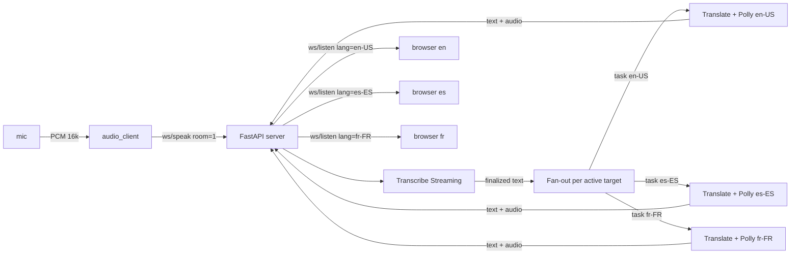
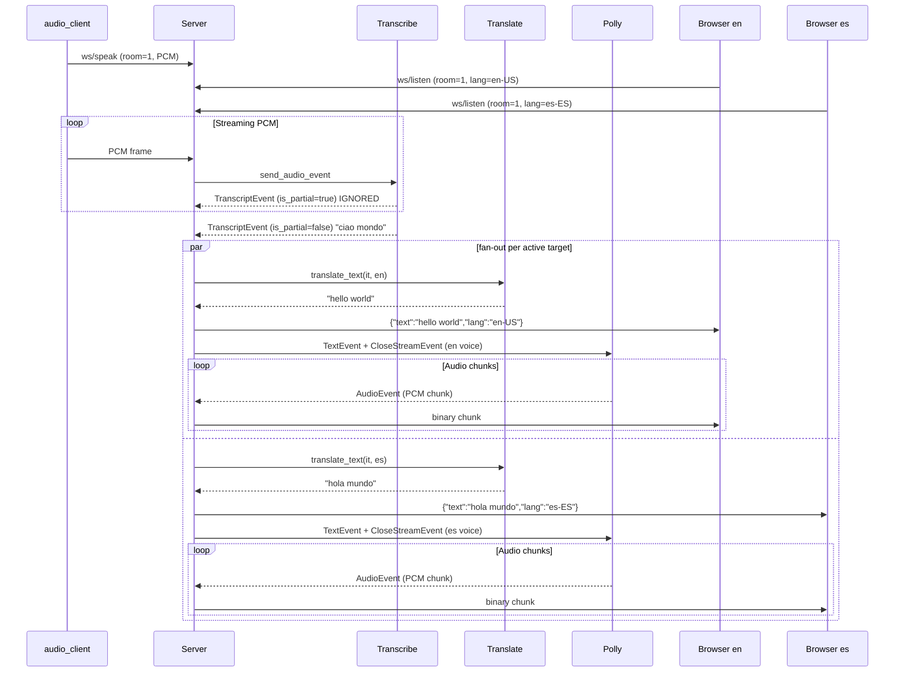

# Speech-to-Speech

Real-time speech translation POC built on Amazon Transcribe Streaming, Amazon Translate, and Amazon Polly bidirectional streaming. Single speaker (PC) plus N listeners on LAN, each in its own target language, monodirectional.

## Architecture

The flow is unidirectional: PCM from a system input device on the speaker side reaches the FastAPI server through a WebSocket, gets transcribed once, then fans out to a Translate plus Polly pipeline per active target language. Each listener subscribes to its own language and receives JSON text plus binary PCM audio over a second WebSocket. Listeners on the same target language share one synthesis pass.



The server orchestrates the AWS pipeline sentence by sentence: it forwards every PCM frame to Amazon Transcribe Streaming, waits for a finalized transcript, snapshots the set of target languages with at least one connected listener, and dispatches a parallel Translate plus Polly task per language; the resulting text and audio chunks are broadcast to all listeners on that language.



## How it works

Three decoupled components, connected via WebSocket to a central server:

1. **FastAPI server** (cloud or any PC): receives audio from the speaker, fans out the Amazon Translate + Polly pipeline per active target language, and dispatches translated text plus audio chunks to all listeners of each language.
2. **Audio client** (Python script): captures audio from a system input device (microphone, mixer) and sends it as binary frames to the server.
3. **Browser display** (HTML + JS, Web Audio API): receives JSON text and binary audio chunks, plays the audio gap-less and shows the translated text.

### Endpoints

| Method | Path | Description |
|--------|------|-------------|
| `GET` | `/` | Browser display index page (defaults `?room=1&lang=en-US`) |
| `GET` | `/api/languages` | JSON list of target languages discovered from Polly generative voices at startup |
| `GET` | `/api/rooms` | JSON list of room ids with at least one connected speaker |
| `GET` | `/rooms` | HTML page listing active rooms as anchors |
| `WS` | `/ws/speak?room=1&lang=it-IT` | Receives PCM audio from the audio client; one speaker per room |
| `WS` | `/ws/listen?room=1&lang=en-US` | Sends translated text (JSON) and audio chunks (binary) for one target language; N listeners per (room, lang) allowed |

## Security

- **No authentication on WebSocket endpoints**: designed for trusted LAN; do not expose to the public internet without adding auth.
- **AWS credentials are not exposed to clients**: only the server communicates with AWS Transcribe, Translate, and Polly.

## Estimated costs

| Resource | Cost |
|----------|------|
| Amazon Transcribe Streaming | $0.024 / min |
| Amazon Translate | $15 / 1M characters |
| Amazon Polly Generative | check the [Amazon Polly pricing page](https://aws.amazon.com/polly/pricing/) |

A 5-minute test run is well under $1. See the linked AWS pricing pages for current rates.

## Prerequisites

### AWS credentials

Configure AWS credentials with a profile that has these permissions: `transcribe:StartStreamTranscription`, `translate:TranslateText`, `polly:DescribeVoices`, `polly:SynthesizeSpeech`.

```sh
aws configure --profile <your-profile>
```

See the [AWS CLI configuration guide](https://docs.aws.amazon.com/cli/latest/userguide/cli-configure-files.html) for details.

### Local network for the mobile test

The browser display runs on the listener's mobile, on the same LAN as the PC that hosts the server. Open the firewall on the PC. On Fedora:

```sh
sudo firewall-cmd --add-port=8000/tcp  # temporary
sudo firewall-cmd --add-port=8000/tcp --permanent && sudo firewall-cmd --reload  # persistent
```

Find the PC LAN IP:

```sh
ip addr show | grep 'inet '
```

## Usage

### Quick start

```sh
# create .env from template
cp .env.example .env
# edit .env with your AWS profile

# start the server
docker compose up
```

In a separate terminal, start the audio client pointing at your input device:

```sh
uv run python -m audio_client --list-devices
uv run python -m audio_client --server ws://localhost:8000 --lang it-IT --room 1 --device "<your-device-name>"
```

On the mobile, on the same LAN, open `http://<pc-lan-ip>:8000/?room=1&lang=en-US`. Both `room` and `lang` are optional and default to `1` and `en-US` (or to the values of `SOURCE_LANG`/`TARGET_LANG` in `.env`). The page shows the active room and language in the status bar; when the speaker finalizes a sentence, the translated text and audio for the chosen language appear.

### Audio client

```sh
# list audio devices
uv run python -m audio_client --list-devices

# send audio from default microphone in italian, default room "1"
uv run python -m audio_client --server ws://localhost:8000

# send audio from device 3 in english, default room "1"
uv run python -m audio_client --device 3 --lang en-US --server ws://localhost:8000

# send audio from device 3 in english, into room "7"
uv run python -m audio_client --device 3 --lang en-US --room 7 --server ws://localhost:8000

# override the WebSocket path (default /ws/speak)
uv run python -m audio_client --ws-path /ws/speak --server ws://localhost:8000
```

### Display

Open the page on the mobile (or any device on the same LAN as the server): `http://<pc-lan-ip>:8000/?room=1&lang=en-US`. Both query parameters are optional; the defaults come from `.env` (`SOURCE_LANG`, `TARGET_LANG`) or, if missing, from the hardcoded fallbacks (`room=1`, `lang=en-US`).

Multiple listeners can share the same `(room, lang)`; the synthesis runs once per (room, lang) per utterance and the audio chunks are broadcast to every connected listener of that language.

To distribute one URL per target language (typical at a meetup with QR codes), discover the supported set from the server and generate one QR code per language. Example with `qrencode`:

```sh
curl -s http://<host>:8000/api/languages | jq -r '.languages[]' | while read lang; do
  qrencode -o "listen-$lang.png" "http://<host>:8000/?room=1&lang=$lang"
done
```

To list the active rooms (rooms with at least one speaker connected): `curl http://<host>:8000/api/rooms` for JSON, or open `http://<host>:8000/rooms` for an HTML index.

### Latency measurement

The repo has two benchmarking scripts that together implement the hybrid measurement approach: server-side stage timestamps plus end-to-end audio cross-correlation.

```sh
# stage breakdown (translate, polly first byte, forward) per utterance
uv run python benchmarks/analyze_timings.py logs/timings.jsonl

# end-to-end latency from a recording with both italian and english speech
uv run python benchmarks/measure_e2e.py recording.wav
```

The recording must contain the italian utterance on the first half and the english playback on the second half. The script uses speech onset detection to find the offset.

## Project structure

```
app/
    __init__.py  # package + version
    main.py  # FastAPI server: HTTP + WebSocket endpoints, pipeline orchestration
    transcribe.py  # Amazon Transcribe Streaming wrapper
    translate.py  # Amazon Translate wrapper
    polly.py  # Amazon Polly synthesis wrapper
    voices.py  # Polly voice discovery (generative engine filter)
    pipeline.py  # AWS-only orchestrator: Transcribe finalized -> Translate -> Polly
    rooms.py  # WebSocket lifecycle: rooms with one speaker plus N listeners per target language
    timing.py  # per-utterance JSON-line timing log
audio_client/
    __init__.py
    __main__.py  # entry point for python -m audio_client
    cli.py  # CLI: audio capture + WebSocket streaming
static/
    index.html  # browser display
    app.js  # WebSocket client: PCM playback queue via Web Audio API
benchmarks/
    __init__.py
    analyze_timings.py  # aggregate timing JSONL into per-utterance stage breakdown
    measure_e2e.py  # speech-onset detection on a recording, e2e latency in ms
tests/
    test_main.py
    test_pipeline.py
    test_rooms.py
    test_polly.py
    test_translate.py
    test_transcribe.py
    test_voices.py
    test_timing.py
    test_analyze_timings.py
pyproject.toml
Makefile
Dockerfile
docker-compose.yaml
.env.example
.pre-commit-config.yaml
```

## Development

Environment installation:

```sh
pip install uv
uv python install 3.13
uv sync
pre-commit install
```

Test tools:

```sh
uv run pytest
uv run ruff check --no-fix .
uv run ruff format --check .
uv run pyright
```

Conventional Commits:

```sh
# use one of the <type> before your message,
# according to the guide https://www.conventionalcommits.org/en/v1.0.0-beta.2/
git commit -m "feat: first version"
```

Versioning management:

```sh
# use one of the following commands according to the guide https://semver.org/
make patch
make minor
make major
```

## Blog post

- [Italian](POST.it.md)
- [English](POST.en.md)

## License

This repo is released under the MIT license. See [LICENSE](LICENSE) for details.
