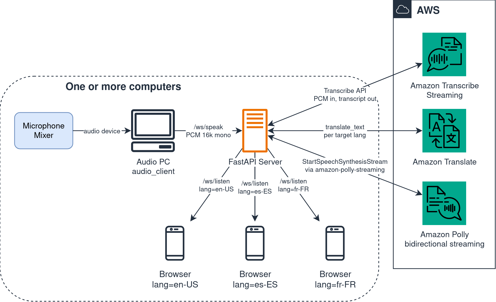
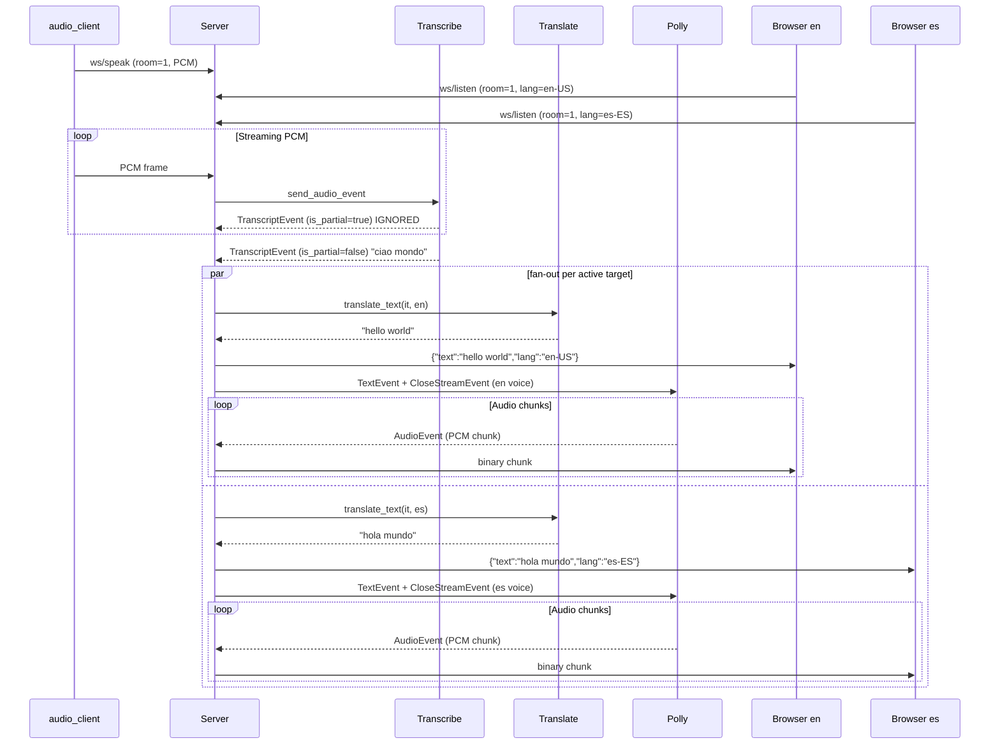

# Speech-to-Speech

Real-time speech translation POC built on Amazon Transcribe Streaming, Amazon Translate, and Amazon Polly bidirectional streaming (via [amazon-polly-streaming](https://amazon-polly-streaming.readthedocs.io/en/latest/)). Single speaker (PC) plus N listeners on LAN, each in its own target language, monodirectional.

## Architecture

The flow is unidirectional: PCM from a system input device on the speaker side reaches the FastAPI server through a WebSocket, gets transcribed once, then fans out to a Translate plus Polly pipeline per active target language. Each listener subscribes to its own language and receives JSON text plus binary PCM audio over a second WebSocket. Listeners on the same target language share one synthesis pass.



The server orchestrates the AWS pipeline sentence by sentence: it forwards every PCM frame to Amazon Transcribe Streaming, waits for a finalized transcript, snapshots the set of target languages with at least one connected listener, and dispatches a parallel Translate plus Polly task per language; the resulting text and audio chunks are broadcast to all listeners on that language.



## How it works

Three decoupled components, connected via WebSocket to a central server:

1. **FastAPI server** (cloud or any PC): receives audio from the speaker, fans out the Amazon Translate + Polly pipeline per active target language, and dispatches translated text plus audio chunks to all listeners of each language
2. **Audio client** (Python script): captures audio from a system input device (microphone, mixer) and sends it as binary frames to the server
3. **Browser display** (HTML + JS, Web Audio API): receives JSON text and binary audio chunks, plays the audio gap-less and shows the translated text

### Endpoints

| Method | Path | Description |
|--------|------|-------------|
| `GET` | `/` | Browser display index page (defaults `?room=1&lang=en-US`) |
| `GET` | `/api/languages` | JSON list of target languages discovered from Polly generative voices at startup |
| `GET` | `/api/rooms` | JSON list of room ids with at least one connected speaker |
| `GET` | `/languages?room=1&token=<LISTENER_TOKEN>` | HTML language picker: links to the listener page for each supported lang, token propagated. Requires `?token=` when `LISTENER_TOKEN` is set |
| `GET` | `/rooms?token=<LISTENER_TOKEN>` | HTML active-rooms picker: links to `/languages?room=<id>` per active room, token propagated. Requires `?token=` when `LISTENER_TOKEN` is set |
| `WS` | `/ws/speak?room=1&lang=it-IT` | Receives PCM audio from the audio client; one speaker per room |
| `WS` | `/ws/listen?room=1&lang=en-US` | Sends translated text (JSON) and audio chunks (binary) for one target language; N listeners per (room, lang) allowed |

## Security

- **Optional shared-secret auth on WebSocket endpoints, split by role**: `SPEAKER_TOKEN` gates `/ws/speak` (the AWS cost driver: Transcribe + Translate + Polly fan-out per active target language), `LISTENER_TOKEN` gates `/ws/listen` (the distribution path via QR codes). Each token is independent: the listener token does NOT grant speaker access and vice versa, so the listener token can be widely distributed without exposing the cost-driver role. Generate each with `python -c "import secrets; print(secrets.token_urlsafe(32))"`. When set, the corresponding endpoint requires a matching `?token=...` query param; mismatched or missing tokens get rejected with WebSocket close code 4401. Either token unset = that endpoint accepts any token (default for local dev on a trusted LAN). For internet-exposed deploys (e.g. AWS via aws-docker-host) set both tokens, bake `LISTENER_TOKEN` into the QR codes for listeners (`...&token=<LISTENER_TOKEN>`) and pass `SPEAKER_TOKEN` to `audio_client` via `--token` or the `SPEAKER_TOKEN` env var
- **AWS credentials are not exposed to clients**: only the server communicates with AWS Transcribe, Translate, and Polly

## Estimated costs

| Resource | Cost |
|----------|------|
| Amazon Transcribe Streaming | $0.024 / min |
| Amazon Translate | $15 / 1M characters ≈ $0.014 / min (*) |
| Amazon Polly Generative | $30 / 1M characters ≈ $0.027 / min (*) |

A 5-minute test run is well under $1. See the linked AWS pricing pages for current rates.

(*) Assuming 150 words/min ≈ 900 characters/min.

## Prerequisites

### AWS credentials

Configure AWS credentials with a profile that has these permissions: `transcribe:StartStreamTranscription`, `translate:TranslateText`, `polly:DescribeVoices`, `polly:StartSpeechSynthesisStream`. Note that `polly:SynthesizeSpeech` is NOT enough for the bidirectional `/v1/synthesisStream` endpoint that this server uses; the streaming variant requires its own action.

```sh
aws configure --profile <your-profile>
```

See the [AWS CLI configuration guide](https://docs.aws.amazon.com/cli/latest/userguide/cli-configure-files.html) for details.

### Local network for the mobile test

The browser display runs on the listener's mobile, on the same LAN as the PC that hosts the server. Open the firewall on the PC. On Fedora:

```sh
sudo firewall-cmd --add-port=8000/tcp  # temporary
sudo firewall-cmd --add-port=8000/tcp --permanent && sudo firewall-cmd --reload  # persistent
```

Find the PC LAN IP:

```sh
ip addr show | grep 'inet '
```

## Usage

### Quick start

```sh
# create .env from template
cp .env.example .env
# edit .env with your AWS profile

# start the server
docker compose up
```

In a separate terminal, start the audio client pointing at your input device:

```sh
# list audio devices to pick the index for your input
uv run python -m audio_client --list-devices

# start the audio client with that device index
make client DEVICE=<your-device-index>
```

On the mobile, on the same LAN, open `http://<pc-lan-ip>:8000/?room=1&lang=en-US`. Both `room` and `lang` are optional and default to `1` and `en-US` (or to the values of `SOURCE_LANG`/`TARGET_LANG` in `.env`). The page shows the active room and language in the status bar; when the speaker finalizes a sentence, the translated text and audio for the chosen language appear.

### Audio client

```sh
# list audio devices (used to pick the right --device index)
uv run python -m audio_client --list-devices

# send audio from default microphone in italian into room 1, against local server
make client

# send audio from device 3 in english into room 1
make client DEVICE=3 SOURCE_LANG=en-US

# send audio from device 3 in english, into room 7
make client DEVICE=3 SOURCE_LANG=en-US ROOM=7

# against a remote server (e.g. AWS deploy via aws-docker-host)
make client SERVER=wss://sts.workshop.pandle.net DEVICE=20
```

The `make client` target uses `SPEAKER_TOKEN` from the shell env when set (no need to pass it on the command line and leak it into shell history): `export SPEAKER_TOKEN=...` once and every subsequent `make client` invocation picks it up.

### Display

See the Endpoints table above for the exact path syntax. The listener flow is `/rooms` → `/languages?room=<id>` → `/?room=<id>&lang=<lang>` (increasing specificity), and each step propagates `LISTENER_TOKEN` automatically when set. For tooling, `/api/rooms` and `/api/languages` provide the same data as JSON without auth.

Multiple listeners can share the same `(room, lang)`; the synthesis runs once per `(room, lang)` per utterance and the audio chunks are broadcast to every connected listener of that language.

### Latency measurement

The repo has two benchmarking scripts that together implement the hybrid measurement approach: server-side stage timestamps plus end-to-end audio cross-correlation.

```sh
# stage breakdown (translate, polly first byte, forward) per utterance
uv run python benchmarks/analyze_timings.py logs/timings.jsonl

# end-to-end latency from a recording with both italian and english speech
uv run python benchmarks/measure_e2e.py recording.wav
```

The recording must contain the italian utterance on the first half and the english playback on the second half. The script uses speech onset detection to find the offset.

### Deploy via aws-docker-host

Hosted deploy through the [aws-docker-host](https://github.com/bilardi/aws-docker-host) terraform repo (sibling repo to this one). Only the base `docker-compose.yaml` is shipped: `docker-compose.override.yaml` stays in this repo for local dev (it mounts `~/.aws` and sets `AWS_PROFILE`, both unwanted on EC2 where credentials come from the IAM role).

Run the steps below from this repo root. They assume `aws-docker-host` is a sibling directory (`../aws-docker-host`).

```sh
# 0. set deploy-specific variables (replace with your values)
export AWS_PROFILE=mine  # AWS profile that terraform uses to provision the EC2 host
HOST=sts.workshop.pandle.net  # subdomain + domain_name from terraform.tfvars
DEVICE=20  # audio device index from `uv run python -m audio_client --list-devices`

# 1. copy runtime files into aws-docker-host inputs (note: .env, not .env.example,
#    so the deploy inherits AWS_REGION, POLLY_USE_POOL and other locally tuned values)
cp -r {Dockerfile,docker-compose.yaml,pyproject.toml,uv.lock,.env,app,static} \
  ../aws-docker-host/inputs/

# 2. bake fresh per-role auth tokens into the deploy .env (speaker drives AWS cost,
#    listener is widely distributed via QR codes; keep them distinct)
cd ../aws-docker-host/inputs
SPEAKER_TOKEN=$(python3 -c "import secrets; print(secrets.token_urlsafe(32))")
LISTENER_TOKEN=$(python3 -c "import secrets; print(secrets.token_urlsafe(32))")
sed -i "s|^SPEAKER_TOKEN=.*|SPEAKER_TOKEN=$SPEAKER_TOKEN|" .env
sed -i "s|^LISTENER_TOKEN=.*|LISTENER_TOKEN=$LISTENER_TOKEN|" .env

# 3. provision the EC2 host
cd ../terraform
terraform init
terraform apply
terraform output nameservers  # configure these on your domain registrar

# 4. generate one QR code pointing to the language picker page
#    (audience scans 1 QR, chooses the language on the page)
qrencode -o "listen.png" "https://$HOST/languages?room=1&token=$LISTENER_TOKEN"

# 5. (on the speaker PC) run audio_client with the speaker token
cd ../../speech-to-speech
export SPEAKER_TOKEN
make client SERVER=wss://$HOST DEVICE=$DEVICE
```

The host exposes the FastAPI server at the URL configured in `aws-docker-host` (a subdomain of the base domain). A `502 Bad Gateway` from that URL with `docker ps -a` showing zero containers on the EC2 means the container did not start: check the user-data / provisioning logs on the EC2 and verify the `inputs/` directory was uploaded correctly.

Operational commands for updates and inspection:

```sh
# apply a change to terraform.tfvars or inputs/.env (run on the local PC, in aws-docker-host/terraform)
terraform apply

# open an interactive shell on the EC2 via SSM (instance id from terraform output or AWS Console)
aws ssm start-session --target <instance-id>

# on the EC2, restart the container after a config-only change (no rebuild needed)
cd /opt/app
sudo docker compose up -d --force-recreate server

# on the EC2, follow the server logs in real-time
sudo docker compose logs -f server
```

## Project structure

```
app/
    __init__.py  # package + version
    main.py  # FastAPI server: HTTP + WebSocket endpoints, pipeline orchestration
    transcribe.py  # Amazon Transcribe Streaming wrapper
    translate.py  # Amazon Translate wrapper
    polly.py  # Amazon Polly synthesis wrapper
    voices.py  # Polly voice discovery (generative engine filter)
    pipeline.py  # AWS-only orchestrator: Transcribe finalized -> Translate -> Polly
    rooms.py  # WebSocket lifecycle: rooms with one speaker plus N listeners per target language
    timing.py  # per-utterance JSON-line timing log
audio_client/
    __init__.py
    __main__.py  # entry point for python -m audio_client
    cli.py  # CLI: audio capture + WebSocket streaming
static/
    index.html  # browser display
    app.js  # WebSocket client: PCM playback queue via Web Audio API
benchmarks/
    __init__.py
    analyze_timings.py  # aggregate timing JSONL into per-utterance stage breakdown
    measure_e2e.py  # speech-onset detection on a recording, e2e latency in ms
tests/
    test_main.py
    test_pipeline.py
    test_rooms.py
    test_polly.py
    test_translate.py
    test_transcribe.py
    test_voices.py
    test_timing.py
    test_analyze_timings.py
pyproject.toml
Makefile
Dockerfile
docker-compose.yaml
.env.example
.pre-commit-config.yaml
```

## Development

Environment installation:

```sh
pip install uv
uv python install 3.13
uv sync
pre-commit install
```

Test tools:

```sh
uv run pytest
uv run ruff check --no-fix .
uv run ruff format --check .
uv run pyright
```

Conventional Commits:

```sh
# use one of the <type> before your message,
# according to the guide https://www.conventionalcommits.org/en/v1.0.0-beta.2/
git commit -m "feat: first version"
```

Versioning management:

```sh
# use one of the following commands according to the guide https://semver.org/
make patch
make minor
make major
```

## Blog post

- [Italian](POST.it.md)
- [English](POST.en.md)

## License

This repo is released under the MIT license. See [LICENSE](LICENSE) for details.
